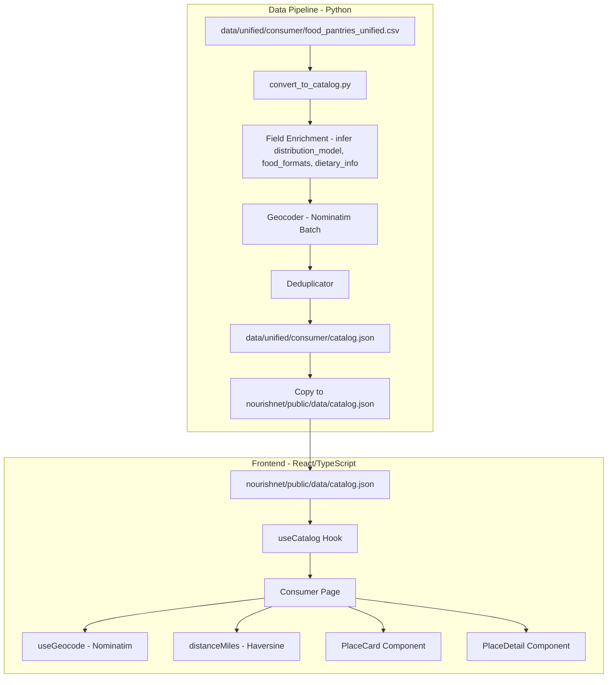
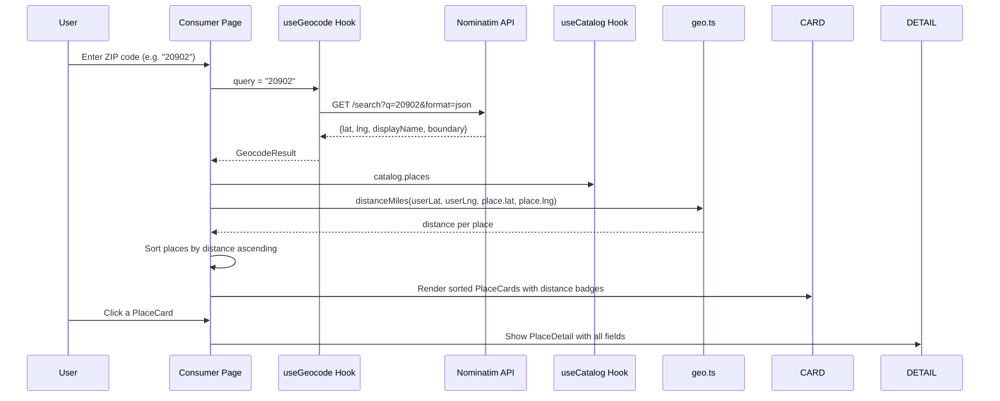
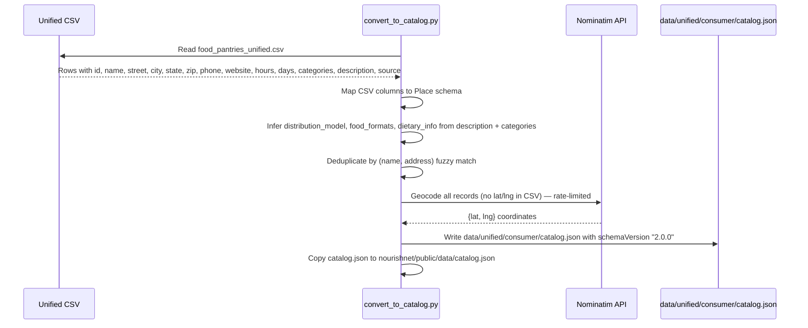

# Design Document: Zipcode Food Locator

## Overview

The Zipcode Food Locator feature converts NourishNet's unified CSV data source into a JSON catalog and enhances the Consumer page to display rich food assistance location details when a user searches by ZIP code. The system has two main parts: (1) a Python conversion pipeline that reads a single unified CSV file (`data/unified/consumer/food_pantries_unified.csv`), maps its columns to the extended `Place` type with new fields (distribution model, food formats, dietary accommodations), geocodes all records (the unified CSV has no lat/lng columns), deduplicates near-duplicates, and writes `catalog.json` to `data/unified/consumer/catalog.json` (the source of truth), then copies it to `nourishnet/public/data/catalog.json` for the Vite frontend to serve; and (2) frontend enhancements to the existing React/TypeScript app that extend the `Place` type, update the `PlaceCard` and `PlaceDetail` components to render the new fields, and leverage the existing Nominatim geocoding + Haversine distance sorting to show nearest locations for a given ZIP code.

The unified CSV already contains pre-assigned UUIDs as IDs and pre-parsed address fields (street, city, state, zip), so the pipeline does not need to generate IDs or parse addresses. The primary work is in reading the single CSV, inferring enrichment fields from `description` and `categories` columns, geocoding addresses to get coordinates, deduplicating, and writing the output JSON. The JSON output lives in `data/unified/consumer/` alongside the source CSV as the canonical location; the copy in `nourishnet/public/data/` exists solely so Vite can serve it as a static asset.

## Architecture



## Sequence Diagrams

### ZIP Code Search Flow



### Data Conversion Pipeline Flow



## Components and Interfaces

### Component 1: Unified CSV Reader (Python)

**Purpose**: Reads the single unified CSV file and maps its columns directly to the Place schema.

**Interface**:
```python
def read_unified_csv(csv_path: str) -> list[Place]:
    """
    Read the unified CSV file and map each row to a Place object.
    
    CSV columns: id, name, street, city, state, zip, county, phone, website,
                 hours, days, contact, categories, description, source_url, source, raw_address
    
    The CSV already has:
    - UUIDs as IDs (use directly, no generation needed)
    - Pre-parsed address fields (street, city, state, zip)
    - No lat/lng columns (all records need geocoding)
    """
    ...
```

**Responsibilities**:
- Read the single CSV file at `data/unified/consumer/food_pantries_unified.csv`
- Map CSV columns directly to Place fields (id→id, name→name, street→address, city→city, etc.)
- Combine `hours` and `days` columns into a human-readable hours string
- Pass `description` and `categories` to inference functions for enrichment
- Set lat/lng to None for all records (CSV has no coordinate columns)

### Component 2: Geocoder (Python)

**Purpose**: Batch-geocode Place records that lack lat/lng coordinates using Nominatim.

**Interface**:
```python
def geocode_missing(places: list[Place], delay_sec: float = 1.1) -> list[Place]:
    """
    For each place with lat=None or lng=None, query Nominatim
    to fill in coordinates. Respects rate limit with delay_sec
    between requests. Returns updated list.
    """
    ...
```

**Responsibilities**:
- Identify records with missing coordinates (all records from unified CSV)
- Query Nominatim with street, city, state, zip
- Respect Nominatim's 1 request/second rate limit
- Cache results in `geocode_cache.json` to avoid re-geocoding on subsequent runs
- Log warnings for addresses that fail to geocode

### Component 3: Deduplicator (Python)

**Purpose**: Remove duplicate locations that may still exist in the unified CSV.

**Interface**:
```python
def deduplicate(places: list[Place]) -> list[Place]:
    """
    Remove duplicates using fuzzy matching on (name, address).
    When duplicates found, merge fields preferring the record
    with more complete data.
    """
    ...
```

**Responsibilities**:
- Normalize names and addresses for comparison (lowercase, strip whitespace, remove punctuation)
- Use fuzzy string matching for near-duplicates (e.g., "St." vs "Saint")
- When merging, prefer the record with more populated fields
- Preserve all unique records

### Component 4: Extended Place Type (TypeScript)

**Purpose**: Frontend type definition with new fields for distribution model, food formats, and dietary info.

**Interface**:
```typescript
export interface Place {
  id: string;
  name: string;
  address: string;
  city: string;
  state: string;
  zip: string;
  county: string | null;
  lat: number | null;
  lng: number | null;
  phone: string;
  email: string | null;
  hours: string;
  eligibility: string;
  requirements: string | null;
  tags: string[];
  source: string;
  // New fields
  distributionModel: string[];   // e.g. ["walk-in", "drive-through", "home-delivery"]
  foodFormats: string[];          // e.g. ["pre-bagged", "groceries", "hot-meals"]
  dietaryInfo: string[];          // e.g. ["halal", "kosher", "vegetarian", "gluten-free"]
  website: string | null;
  hoursStructured: DayHours[] | null;
}

export interface DayHours {
  day: string;            // "Monday" | "Tuesday" | ... | "Sunday"
  hours: string;          // "9:00 AM - 3:00 PM" or "Closed"
  byAppointment: boolean;
  residentsOnly: boolean;
  notes: string | null;
}
```

### Component 5: Enhanced PlaceCard (TypeScript/React)

**Purpose**: Updated card component showing distribution model and food format badges.

**Responsibilities**:
- Display existing fields (name, city, state, zip, county, hours, distance)
- Render `distributionModel` as icon badges (🚗 drive-through, 🚶 walk-in, 🏠 home-delivery)
- Render `foodFormats` as colored tag pills
- Keep card compact — show max 3 tags with "+N more" overflow

### Component 6: Enhanced PlaceDetail (TypeScript/React)

**Purpose**: Updated detail panel showing all new fields.

**Responsibilities**:
- Display all existing fields
- Show structured hours table (day-by-day) when `hoursStructured` is available
- Show distribution model section with icons and labels
- Show food formats section
- Show dietary accommodations section
- Show email and website links when available

## Data Models

### Extended Place (Python — for conversion script)

```python
from dataclasses import dataclass, field

@dataclass
class Place:
    id: str
    name: str
    address: str
    city: str
    state: str
    zip: str
    county: str | None
    lat: float | None
    lng: float | None
    phone: str
    email: str | None
    hours: str
    eligibility: str
    requirements: str | None
    tags: list[str]
    source: str
    distribution_model: list[str]
    food_formats: list[str]
    dietary_info: list[str]
    website: str | None
    hours_structured: list[dict] | None

    def to_dict(self) -> dict:
        """Serialize to JSON-compatible dict with camelCase keys."""
        ...
```

**Validation Rules**:
- `id` must be non-empty and unique across all places (UUIDs from unified CSV)
- `name` must be non-empty
- `address` must be non-empty
- `state` must be "MD" or "DC"
- `zip` must match pattern `^\d{5}$` or be empty string
- `lat` if present must be in range [37.0, 40.0] (Maryland/DC latitude range)
- `lng` if present must be in range [-80.0, -75.0] (Maryland/DC longitude range)
- `distribution_model` values must be from allowed set: `["walk-in", "drive-through", "home-delivery", "mobile-pantry", "by-appointment"]`
- `food_formats` values must be from allowed set: `["pre-bagged", "groceries", "hot-meals", "produce", "prepared-meals", "shelf-stable"]`

### Catalog Schema v2.0.0

```typescript
export interface Catalog {
  schemaVersion: "2.0.0";
  generatedAt: string;
  sources: SourceMeta[];
  places: Place[];
  opportunities: Opportunity[];
}

export interface SourceMeta {
  id: string;
  name: string;
  recordCount: number;
  lastUpdated: string;
}
```

### Unified CSV Column Mapping

The single source file `data/unified/consumer/food_pantries_unified.csv` has these columns:

| CSV Column | Place Field | Notes |
|---|---|---|
| `id` | `id` | UUID, use directly |
| `name` | `name` | Direct mapping |
| `street` | `address` | Direct mapping |
| `city` | `city` | Direct mapping |
| `state` | `state` | Direct mapping |
| `zip` | `zip` | Direct mapping |
| `county` | `county` | May be empty |
| `phone` | `phone` | Direct mapping |
| `website` | `website` | Direct mapping |
| `hours` | `hours` (partial) | Combined with `days` column |
| `days` | `hours` (partial) | Combined with `hours` column |
| `contact` | — | Not mapped to Place (informational) |
| `categories` | `tags`, inference input | Split on `;` for tags; used for inference |
| `description` | inference input | Used for distribution_model, food_formats, dietary_info inference |
| `source_url` | — | Not mapped (metadata) |
| `source` | `source` | Direct mapping |
| `raw_address` | — | Not needed (street/city/state/zip already parsed) |
| — | `lat` | Not in CSV; set to None, filled by geocoder |
| — | `lng` | Not in CSV; set to None, filled by geocoder |


## Algorithmic Pseudocode

### Unified CSV Reader

```python
import csv

def read_unified_csv(csv_path: str = "data/unified/consumer/food_pantries_unified.csv") -> list[Place]:
    """
    Read the unified CSV and map each row to a Place object.
    No ID generation or address parsing needed — CSV has UUIDs and parsed fields.
    """
    places = []
    with open(csv_path, newline="", encoding="utf-8") as f:
        reader = csv.DictReader(f)
        for row in reader:
            # Combine hours and days into human-readable string
            hours_str = build_hours_string(row.get("hours", ""), row.get("days", ""))

            # Split categories on semicolons for tags
            categories_raw = row.get("categories", "")
            tags = [c.strip() for c in categories_raw.split(";") if c.strip()]

            description = row.get("description", "")

            place = Place(
                id=row["id"],
                name=row["name"],
                address=row.get("street", ""),
                city=row.get("city", ""),
                state=row.get("state", "MD"),
                zip=row.get("zip", ""),
                county=row.get("county", "") or None,
                lat=None,   # Not in CSV — geocoder fills this
                lng=None,   # Not in CSV — geocoder fills this
                phone=row.get("phone", ""),
                email=None,  # Not in unified CSV
                hours=hours_str,
                eligibility="",
                requirements=None,
                tags=tags,
                source=row.get("source", ""),
                distribution_model=infer_distribution_model(description, "", categories_raw, False),
                food_formats=infer_food_formats(description, categories_raw, tags),
                dietary_info=infer_dietary_info(description, categories_raw),
                website=row.get("website", "") or None,
                hours_structured=None,
            )
            places.append(place)
    return places
```

**Preconditions:**
- `csv_path` points to a valid CSV file with the expected columns
- CSV has header row: id, name, street, city, state, zip, county, phone, website, hours, days, contact, categories, description, source_url, source, raw_address

**Postconditions:**
- Returns a list of Place objects, one per CSV row
- All Place objects have lat=None, lng=None (to be filled by geocoder)
- IDs are UUIDs from the CSV (not generated)
- Address fields are taken directly from CSV columns (not parsed)

### Hours String Builder

```python
def build_hours_string(hours: str, days: str) -> str:
    """
    Combine hours and days columns into a single human-readable string.
    """
    hours = hours.strip()
    days = days.strip()

    if hours and days:
        return f"{days}: {hours}"
    elif hours:
        return hours
    elif days:
        return days
    else:
        return "Hours not available"
```

**Preconditions:**
- `hours` and `days` are strings (may be empty)

**Postconditions:**
- Returns a non-empty string
- Defaults to "Hours not available" when both inputs are empty

### Distribution Model Inference

```python
DISTRIBUTION_KEYWORDS = {
    "walk-in": ["walk-in", "walk in", "come to", "visit"],
    "drive-through": ["drive-through", "drive through", "drive-thru", "curbside", "drive-up"],
    "home-delivery": ["home deliver", "delivery", "delivered", "mobile pantry delivery"],
    "mobile-pantry": ["mobile pantry", "mobile food", "pop-up"],
    "by-appointment": ["by appointment", "appointment only", "call ahead"],
}

def infer_distribution_model(
    description: str, notes: str, categories: str, by_appointment: bool
) -> list[str]:
    """
    Infer distribution model(s) from text fields.
    Returns list of matching model strings.
    """
    text = f"{description} {notes} {categories}".lower()
    models = []

    for model, keywords in DISTRIBUTION_KEYWORDS.items():
        if any(kw in text for kw in keywords):
            models.append(model)

    if by_appointment and "by-appointment" not in models:
        models.append("by-appointment")

    # Default to walk-in if nothing inferred
    if not models:
        models = ["walk-in"]

    return models
```

**Preconditions:**
- All string inputs may be empty but not None
- `by_appointment` is a boolean

**Postconditions:**
- Returns a non-empty list of distribution model strings
- All returned values are from the allowed set
- Defaults to `["walk-in"]` when no keywords match

### Food Format Inference

```python
FOOD_FORMAT_KEYWORDS = {
    "pre-bagged": ["pre-bagged", "prebagged", "pre-packed", "food box", "food bag"],
    "groceries": ["groceries", "grocery", "choice pantry", "client choice"],
    "hot-meals": ["hot meal", "hot food", "soup kitchen", "cooked meal", "prepared meal"],
    "produce": ["produce", "fresh fruit", "fresh vegetable", "farm"],
    "prepared-meals": ["prepared meal", "ready to eat", "frozen meal"],
    "shelf-stable": ["canned", "non-perishable", "nonperishable", "shelf stable", "dry goods", "perishable and nonperishable"],
}

def infer_food_formats(description: str, categories: str, tags: list[str]) -> list[str]:
    """
    Infer food format(s) from text fields and tags.
    """
    text = f"{description} {categories} {' '.join(tags)}".lower()
    formats = []

    for fmt, keywords in FOOD_FORMAT_KEYWORDS.items():
        if any(kw in text for kw in keywords):
            formats.append(fmt)

    # Default to groceries for generic pantries
    if not formats:
        formats = ["groceries"]

    return formats
```

**Preconditions:**
- String inputs may be empty but not None
- `tags` is a list of strings

**Postconditions:**
- Returns a non-empty list of food format strings
- All returned values are from the allowed set
- Defaults to `["groceries"]` when no keywords match

### Fuzzy Deduplication Algorithm

```python
from difflib import SequenceMatcher

def deduplicate(places: list[Place], threshold: float = 0.85) -> list[Place]:
    """
    Remove near-duplicate places using fuzzy matching on name + address.
    When duplicates found, keep the record with more populated fields.
    """
    unique: list[Place] = []
    seen_keys: list[str] = []

    for place in places:
        key = f"{place.name.lower().strip()} | {place.address.lower().strip()}"
        is_dup = False

        for existing_key in seen_keys:
            similarity = SequenceMatcher(None, key, existing_key).ratio()
            if similarity >= threshold:
                is_dup = True
                break

        if not is_dup:
            unique.append(place)
            seen_keys.append(key)

    return unique
```

**Preconditions:**
- `places` is a list of Place objects with populated name and address
- `threshold` is a float in range (0.0, 1.0]

**Postconditions:**
- Returns a list with no near-duplicate entries
- `len(result) <= len(places)`
- All unique places are preserved
- Order is preserved (first occurrence kept)

**Loop Invariants:**
- `len(unique) == len(seen_keys)` at all times
- All entries in `unique` are pairwise dissimilar (below threshold)

## Key Functions with Formal Specifications

### Main Pipeline: convert_to_catalog()

```python
def convert_to_catalog(
    csv_path: str = "data/unified/consumer/food_pantries_unified.csv",
    output_path: str = "data/unified/consumer/catalog.json",
    frontend_copy_path: str = "nourishnet/public/data/catalog.json",
    geocode: bool = True,
) -> dict:
    """
    Main entry point. Reads the unified CSV, enriches fields,
    deduplicates, geocodes, and writes catalog.json to the
    unified data folder (source of truth), then copies it to
    the Vite public folder for frontend serving.
    """
    ...
```

**Preconditions:**
- `csv_path` exists and is a valid CSV with expected columns
- `output_path` parent directory exists
- `frontend_copy_path` parent directory exists
- Network available if `geocode` is True

**Postconditions:**
- Writes a valid JSON file to `output_path` (`data/unified/consumer/catalog.json`)
- Copies the same file to `frontend_copy_path` (`nourishnet/public/data/catalog.json`)
- JSON conforms to Catalog schema v2.0.0
- All places have non-empty id, name, address
- No duplicate places in output (by fuzzy name+address match)
- Returns the catalog dict

### Frontend: distanceMiles() (existing)

```typescript
function distanceMiles(
  lat1: number, lng1: number,
  lat2: number, lng2: number
): number
```

**Preconditions:**
- All inputs are valid finite numbers
- Latitudes in range [-90, 90], longitudes in range [-180, 180]

**Postconditions:**
- Returns distance in miles >= 0
- Result is symmetric: `distanceMiles(a,b,c,d) === distanceMiles(c,d,a,b)`
- Result is 0 when both points are identical

## Example Usage

### Running the Conversion Script

```python
# From project root:
# python convert_to_catalog.py

# Or with options:
# python convert_to_catalog.py --no-geocode  (skip geocoding, faster)
# python convert_to_catalog.py --output custom/path/catalog.json

if __name__ == "__main__":
    import argparse
    parser = argparse.ArgumentParser(description="Convert unified CSV to catalog.json")
    parser.add_argument("--no-geocode", action="store_true", help="Skip geocoding")
    parser.add_argument("--output", default="data/unified/consumer/catalog.json",
                        help="Primary output path (source of truth)")
    parser.add_argument("--frontend-copy", default="nourishnet/public/data/catalog.json",
                        help="Frontend copy path for Vite serving")
    args = parser.parse_args()

    catalog = convert_to_catalog(
        geocode=not args.no_geocode,
        output_path=args.output,
        frontend_copy_path=args.frontend_copy,
    )
    print(f"Wrote {len(catalog['places'])} places to {args.output}")
    print(f"Copied to {args.frontend_copy}")
```

### Frontend: Consuming Extended Place Data

```typescript
// In Consumer.tsx — existing sort logic works unchanged
const filtered = useMemo(() => {
  if (!catalog) return [];
  let list = catalog.places;

  // Existing filters still work...
  if (userCoords) {
    list = [...list].sort((a, b) => {
      const da = a.lat != null && a.lng != null
        ? distanceMiles(userCoords[0], userCoords[1], a.lat, a.lng) : Infinity;
      const db = b.lat != null && b.lng != null
        ? distanceMiles(userCoords[0], userCoords[1], b.lat, b.lng) : Infinity;
      return da - db;
    });
  }
  return list;
}, [catalog, userCoords]);

// New: filter by distribution model
const filteredByModel = useMemo(() => {
  if (!modelFilter) return filtered;
  return filtered.filter(p =>
    p.distributionModel.includes(modelFilter)
  );
}, [filtered, modelFilter]);
```

### PlaceDetail Rendering New Fields

```typescript
// In PlaceDetail.tsx — new sections
{place.distributionModel.length > 0 && (
  <div className="bg-gray-50 rounded-xl p-3">
    <div className="text-xs font-semibold text-gray-400 uppercase mb-1">
      How to Get Food
    </div>
    <div className="flex flex-wrap gap-1.5">
      {place.distributionModel.map(m => (
        <span key={m} className="bg-blue-100 text-blue-700 text-xs px-2 py-1 rounded-full">
          {MODEL_ICONS[m]} {MODEL_LABELS[m]}
        </span>
      ))}
    </div>
  </div>
)}

{place.foodFormats.length > 0 && (
  <div className="bg-gray-50 rounded-xl p-3">
    <div className="text-xs font-semibold text-gray-400 uppercase mb-1">
      Food Available
    </div>
    <div className="flex flex-wrap gap-1.5">
      {place.foodFormats.map(f => (
        <span key={f} className="bg-amber-100 text-amber-700 text-xs px-2 py-1 rounded-full">
          {FORMAT_LABELS[f]}
        </span>
      ))}
    </div>
  </div>
)}
```

## Correctness Properties

The following properties must hold for the system:

1. **ID Uniqueness**: ∀ places p1, p2 in catalog: p1.id ≠ p2.id when p1 ≠ p2
2. **ID Preservation**: IDs from the unified CSV are used as-is (UUIDs); no generation or transformation
3. **No Data Loss**: Every valid record from the unified CSV appears in the output catalog (unless deduplicated)
4. **Distance Sorting**: When userCoords is set, ∀ adjacent places (p[i], p[i+1]) in the sorted list: distance(user, p[i]) ≤ distance(user, p[i+1])
5. **Coordinate Bounds**: ∀ place p with lat ≠ null: 37.0 ≤ p.lat ≤ 40.0 ∧ -80.0 ≤ p.lng ≤ -75.0
6. **ZIP Format**: ∀ place p: p.zip matches `^\d{5}$` or p.zip is empty string
7. **Non-Empty Defaults**: ∀ place p: len(p.distributionModel) ≥ 1 ∧ len(p.foodFormats) ≥ 1
8. **Schema Compatibility**: Output catalog.json is valid against Catalog TypeScript interface (parseable by `useCatalog` hook)
9. **Deduplication Correctness**: No two places in output have fuzzy name+address similarity ≥ 0.85
10. **Haversine Symmetry**: distanceMiles(a, b) === distanceMiles(b, a) for all coordinate pairs
11. **Geocoding Idempotency**: Running the pipeline twice with same inputs produces identical output in both `data/unified/consumer/catalog.json` and `nourishnet/public/data/catalog.json` (via cache)
12. **Single Source**: Pipeline reads exactly one CSV file — no multi-source adapter logic
13. **Output Consistency**: `data/unified/consumer/catalog.json` (source of truth) and `nourishnet/public/data/catalog.json` (frontend copy) are byte-identical after each pipeline run

## Error Handling

### Error Scenario 1: Unified CSV Missing or Malformed

**Condition**: The unified CSV file at `data/unified/consumer/food_pantries_unified.csv` is missing or has unexpected columns
**Response**: Log an error and exit with non-zero status; no partial catalog is written
**Recovery**: User must ensure the unified CSV exists and has the expected columns

### Error Scenario 2: Nominatim Geocoding Failure

**Condition**: Nominatim returns no results or HTTP error for an address
**Response**: Keep the place with `lat: null, lng: null`; log the address that failed
**Recovery**: Place appears in catalog but without map pin (existing UI already handles this with "📍 Address only — no map pin" badge)

### Error Scenario 3: Nominatim Rate Limiting

**Condition**: Nominatim returns HTTP 429 (too many requests)
**Response**: Exponential backoff starting at 2 seconds, max 3 retries per address
**Recovery**: After max retries, skip geocoding for that address and continue

### Error Scenario 4: Invalid Coordinates from Geocoder

**Condition**: Geocoder returns lat/lng values outside Maryland/DC bounds
**Response**: Set lat/lng to null for that record; log warning
**Recovery**: Place treated as un-geocoded; shown without map pin

### Error Scenario 5: Empty or Blank CSV Rows

**Condition**: A CSV row has empty `name` or `id` field
**Response**: Skip the row and log a warning
**Recovery**: Pipeline continues with remaining valid rows

## Testing Strategy

### Unit Testing Approach

- Test `read_unified_csv()` with a small sample CSV containing representative rows
- Test `build_hours_string()` with various combinations of hours and days values
- Test `infer_distribution_model()` and `infer_food_formats()` with known text inputs
- Test `deduplicate()` with known duplicate and unique records
- Test TypeScript `Place` type compatibility with sample JSON output

### Property-Based Testing Approach

**Property Test Library**: hypothesis (Python), fast-check (TypeScript)

- **Dedup Idempotency**: `deduplicate(deduplicate(places)) == deduplicate(places)`
- **Distance Non-Negativity**: For any valid coordinates, `distanceMiles` returns >= 0
- **Distance Symmetry**: `distanceMiles(a,b,c,d) == distanceMiles(c,d,a,b)`
- **Sort Correctness**: After sorting by distance, list is monotonically non-decreasing
- **Inference Non-Empty**: For any input strings, `infer_distribution_model` and `infer_food_formats` return non-empty lists

### Integration Testing Approach

- End-to-end: Run `convert_to_catalog.py --no-geocode` on actual unified CSV, validate output JSON schema at `data/unified/consumer/catalog.json` and verify the copy at `nourishnet/public/data/catalog.json` is identical
- Frontend: Load generated `catalog.json` in test, verify `useCatalog` hook parses without error
- Verify ZIP code search → geocode → sort → render pipeline with known ZIP codes

## Performance Considerations

- **Geocoding Bottleneck**: Nominatim rate limit (1 req/sec) means geocoding N addresses takes ~N seconds. Since the unified CSV has no lat/lng, ALL records need geocoding on first run. Cache results in `geocode_cache.json` to avoid re-geocoding on subsequent runs. Use `--no-geocode` flag for fast iteration during development.
- **Catalog Size**: With hundreds of pantries, catalog.json should be well under 1 MB. If it grows beyond 5 MB, consider splitting by county or lazy-loading.
- **Frontend Sort**: Haversine calculation for ~1000 places is O(n log n) sort — negligible on modern browsers.
- **Deduplication**: O(n²) fuzzy matching is acceptable for expected dataset size (<2k records). For larger datasets, consider blocking by ZIP code first.

## Security Considerations

- **No API Keys**: Nominatim is free and requires no API key. No secrets to manage.
- **User-Agent Header**: Nominatim requires a descriptive User-Agent. Use `"NourishNet-ClassProject/1.0"` (already set in `useGeocode.ts`).
- **No PII**: Food assistance location data is public. No personal user data is stored or transmitted.
- **Input Sanitization**: ZIP code input is already handled by Nominatim geocoding; no direct database queries.

## Dependencies

### Python (Data Pipeline)
- `csv` — CSV reading (stdlib)
- `requests` — HTTP client for Nominatim geocoding
- `difflib` — Fuzzy string matching for deduplication (stdlib)
- `argparse` — CLI argument parsing (stdlib)
- `json` — JSON output (stdlib)

### Frontend (Existing — No New Dependencies)
- `react`, `react-dom` — UI framework
- `react-leaflet`, `leaflet` — Map rendering
- `react-router-dom` — Routing
- `tailwindcss` — Styling
- No new npm packages required
